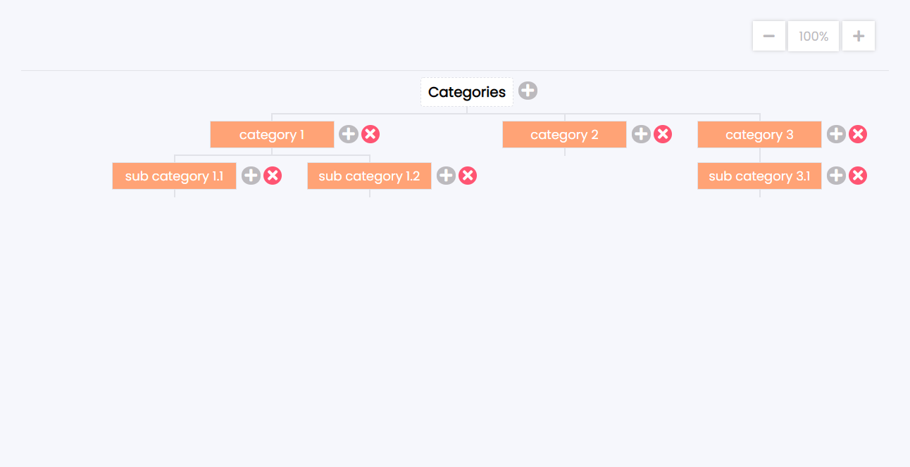

# Organization chart without any plugin

Front-end Developer / task

## İstifadə olunan texnologiyalar

- HTML
- pure CSS
- pure JavaScript

## Kateqoriyalara aid funksiyalar

- Səhifəyə daxil olduğunuz zaman bir "root" elementlə qarşılaşırsınız. Bu elementi silmək mümkün deyil.

- Sağ tərəfindəki "+" butonuna tıklayaraq yeni kateqoriya əlavə etmək mümkündür.

- Aşağıda yeni kateqoriya yarandığı zaman ona ad verməlisiniz, yoxsa səhifənin sol yuxarı hissəsində "alert" çıxacaq.

- İstədiyiniz adı verdikdən sonra sol tərəfdəki yaşıl butona tıklayaraq "save" etmək mümkündür. Və ya yaşıl butonun yanındakı qırmızı butona tıkladıqda isə yaratdığınız kateqoriya silinəcək.

- Hansı elementin altına yeni kateqoriya əlavə etmək istəyirsinizsə, onun sol tərəfindəki "+" butonuna tıklaya bilərsiniz.

- Hansı elementi silmək istəyirsinizsə, onun sol tərəfindəki qırmızı butona tıklaya bilərsiniz. Bu zaman silinən kateqoriya ilə əlaqəli alt kateqoriyalar varsa, onlar da silinəcək.

## Zoom etmək funksiyası

- Səhifənin sağ yuxarı küncündəki uyğun butonlara tıklayaraq səhifəni "zoom in" və ya "zoom out" edə bilərsiniz.

- Həmçinin, bu butonların ortasında yerləşən hissəyə tıklayaraq da istənilən faizi seçmək mümkündür. Seçilən faizə uyğun səhifə "zoom in" və ya "zoom out" olacaq.

## Drag funksiyası

- Ən yuxarıda yerləşən "root" elementin üzərinə basılı saxlayaraq bütün qrafiki isənilən yerə sürüşdürmək (drag) mümkündür.

#### &copy; Sheyda Sultanova 2021